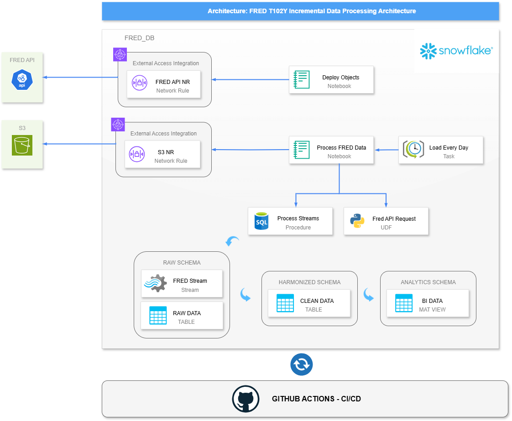

# CI/CD with Snowflake Notebooks

- **Streamlit App:** [https://treasury-spread.streamlit.app/](https://treasury-spread.streamlit.app/)
- **Lambda API Endpoint:** [https://culio1s6lj.execute-api.us-east-1.amazonaws.com/fred_stage/fred](https://culio1s6lj.execute-api.us-east-1.amazonaws.com/fred_stage/fred)

## Overview

This document explains the process of setting up a CI/CD pipeline for deploying and synchronizing Snowflake notebooks. Before implementing CI/CD, initial data objects must be created to establish the required environment.

## Initial Data Object Creation

Before executing the CI/CD pipeline, we need to set up fundamental Snowflake objects, including:

1. **User and Role Setup**
   - A dedicated role (`FRED_ROLE`) is created and assigned necessary permissions.
   - A user (`DBT_DEV`) is assigned to the role.

2. **Database and Schema Creation**
   - The database (`FRED_DB`) and essential schemas (`INTEGRATIONS`, `FRED_RAW`, `FRED_HARMONIZED`, `FRED_ANALYTICS`) are created.

3. **Warehouse and Compute Setup**
   - A Snowflake warehouse (`FRED_WH`) is configured for query execution.

4. **Secret Management**
   - AWS credentials and GitHub credentials are securely stored using Snowflake secrets.

5. **Network Configuration**
   - External access integrations and network rules are established to connect with external data sources.

6. **Data Storage and Processing**
   - Stages, tables, streams, and materialized views are created for handling data efficiently.
   - Snowflake functions and stored procedures are implemented for automation.

## Deploy and Synchronize Notebooks

1. **Deploy Notebooks**
   - The CI/CD pipeline ensures that all Snowflake notebooks are deployed from the repository to the Snowflake environment.
   - Notebooks are executed automatically to maintain an updated and consistent Snowflake environment.

2. **Automated Synchronization**
   - Any changes made to the `.ipynb` files in the repository are automatically fetched and applied to Snowflake.
   - The latest version of each notebook is set as the live version and executed to reflect updates in the environment.

## Architecture Diagram and Process Flow

The following steps outline the architecture and data flow:

1. **Data Ingestion to S3**
   - Data is staged to an AWS S3 bucket daily at **6:30 PM EST** using a **User-Defined Function (UDF)**.

2. **Data Loading into Raw Schema**
   - A Snowflake **task** reads data from the external S3 stage and writes it into the `FRED_RAW` schema.

3. **Data Cleansing and Consistency Checks**
   - A **stored procedure** removes duplicates and ensures data consistency.
   - The processed data is then loaded into the `FRED_HARMONIZED` schema.

4. **Notebook Execution**
   - The Snowflake task **triggers a notebook** deployed in Snowflake, which orchestrates the data movement and processing.

5. **Materialized View in Analytics Schema**
   - Once data is loaded into the `FRED_HARMONIZED` schema, a **materialized view** in the `FRED_ANALYTICS` schema links to the harmonized data layer.

6. **Incremental Data Processing**
   - **Streams** facilitate incremental data movement from `FRED_RAW` to `FRED_HARMONIZED`, ensuring efficient updates.

## Summary

This CI/CD pipeline ensures a structured and automated approach to deploying and synchronizing Snowflake notebooks. By establishing initial data objects and leveraging GitHub Actions, teams can efficiently manage data workflows and maintain a stable production environment.

